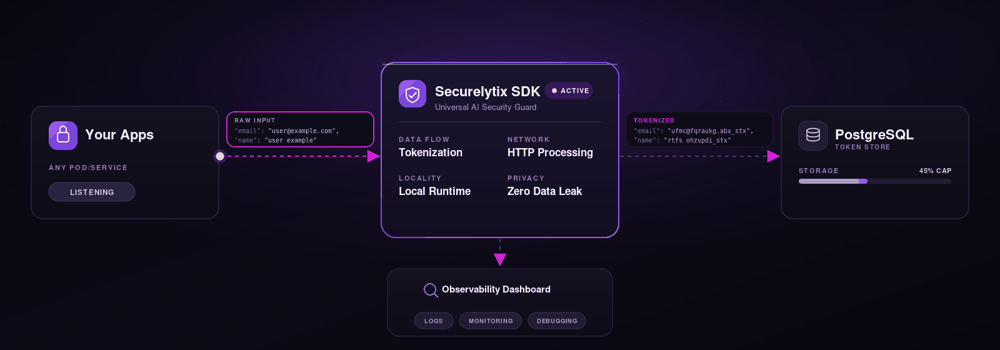

<!-- markdownlint-disable MD030 -->

<table align="center" border="0">
<tr>
<td align="center">

<a href="https://www.securelytix.tech/">
  
</a>

<br><br>

<a href="https://golang.org">
  
</a>
<a href="https://www.postgresql.org">
  
</a>
<a href="https://www.docker.com">
  
</a>
<a href="https://opentelemetry.io">
  
</a>
<a href="https://clickhouse.com">
  
</a>

<br><br>

<a href="https://www.securelytix.tech/">
  
</a>

&nbsp;&nbsp;&nbsp;

<a href="https://portal.securelytix.tech/">
  
</a>

</td>
</tr>
</table>

| 🔍 Observability | 🔒 PII Detection | 🛡️ Fail-Closed Guard |
| :--------------: | :--------------: | :------------------: |
| 📊 OTel Tracing & Metrics | 🧬 Format-Preserving HMACs | 🔒 Hardware-Locked Quotas |

## VaultKey by Securelytix

VaultKey is a high-performance runtime data protection platform that automatically discovers Personally Identifiable Information (PII), replaces sensitive values with deterministic format-preserving tokens, and securely stores the original mappings inside your own PostgreSQL database.
Instead of relying on application developers to manually protect data, VaultKey detect PII before it reaches downstream systems—ensuring plaintext PII never lands in databases, logs, analytics platforms, AI models, or third-party services.
> **The database is only as secure as the data entering it.**
> VaultKey by Securelytix prevents plaintext PII from reaching your analytics, model logs, and database tables by tokenizing sensitive fields in real-time at the API gateway level.

No complex library imports. No database driver rewrites. Runtime tokenization where your workloads actually run.

---
## 📚 Table of Contents

- [What Securelytix Answers](#what-securelytix-answers)
- [System Architecture & Services](#system-architecture--services)
- [API Endpoint Schemas](#api-endpoint-schemas)
- [Quick Start (2 mins)](#quick-start-2-mins)
- [Securelytix Developer Console](#securelytix-developer-console)
- [Supported PII Validation Matrix](#supported-pii-validation-matrix)
- [Community vs Enterprise](#community-vs-enterprise)

---

## What Securelytix Answers

| Question | What you get |
|---|---|
| **What sensitive data is entering my applications?** | Automatically discovers and tokenizes PII such as email addresses, phone numbers, names, PAN, Aadhaar, credit cards, UPI IDs, IP addresses, and more before the data is stored or forwarded. |
| **Can I recover the original values when needed?** | Securely detokenizes previously tokenized data using protected token-to-value mappings stored in your self-hosted PostgreSQL token vault. |
| **Will my applications continue to work without schema changes?** | Format-preserving tokenization preserves the original data structure, allowing existing applications, validations, and downstream systems to continue working with minimal code changes. |
| **Where are the original values stored?** | Original PII remains securely stored in your PostgreSQL token vault, while applications, databases, logs, analytics platforms, and AI systems receive only deterministic tokens. |
| **How is platform usage controlled?** | A fail-closed licensing engine binds deployments to the host machine, validates licenses, and enforces usage quotas to prevent unauthorized usage. |
| **How can I monitor tokenization activity?** | Built-in OpenTelemetry integration exports traces, metrics, and operational telemetry, with real-time visibility available through the Securelytix Developer Console. |

---

## System Architecture & Services

The standalone service operates through five distinct components:

- **Ingress Flat-Scanner**: Flattens nested JSON payloads recursively and matches key/value combinations against active PII rules.
- **HMAC Tokenizer**: -Detects sensitive values and replaces them with format-preserving HMAC tokens ending in the `_stx` suffix..
- **Postgres Mapping Agent**: Stores token mappings using high-performance transactional upserts.
- **Licensing Daemon**: Validates cryptographic JWS tokens, checks local rate limit states, and syncs usage deltas asynchronously.
- **OpenTelemetry Exporter**: Packs and ships metrics/traces via compressed HTTP/gRPC pipelines.
<div align="center">
  

  <br><br>

  <sub>
    End-to-end request flow showing PII detection, format-preserving tokenization,
    secure PostgreSQL token storage, and real-time observability.
  </sub>
</div>

---

## API Endpoint Schemas

### 1. Tokenize Payload
Redacts PII fields in a JSON structure and returns tokens.

* **Endpoint:** `POST /api/v1/tokenize`
* **Request Body:**
  ```json
  {
    "data": {
      "email": "user@example.com",
      "name": "user example"
    }
  }
  ```
* **Response Body (200 OK):**
  ```json
  {
    "data": {
      "email": "ufmc@fqraukg.abx_stx",
      "name": "rtfs ohzvpdi_stx"
    },
    "request_id": "65ffccb6-ab99-4aed-b049-7677be02ac57",
    "client_id": "stx_93d650fa46defe24131894ef"
  }
  ```
* **Response Headers:**
  * `X-Requests-Remaining`: The remaining API quota left for the client (e.g., `9989`).
* **Errors:**
  * `400 Bad Request`: Invalid JSON body or missing `"data"` field.
  * `429 Too Many Requests`: Usage quota limit exhausted.

### 2. Detokenize Payload
Resolves token values back to plaintext.

* **Endpoint:** `POST /api/v1/detokenize`
* **Request Body:**
  ```json
  {
    "data": {
      "email": "ufmc@fqraukg.abx_stx",
      "name": "rtfs ohzvpdi_stx"
    }
  }
  ```
* **Response Body (200 OK):**
  ```json
  {
    "data": {
      "email": "user@example.com",
      "name": "user example"
    },
    "status": "success",
    "request_id": "8e3c63fa-b054-46c2-b918-6efc0293d4ef",
    "client_id": "stx_93d650fa46defe24131894ef"
  }
  ```

---

## Quick Start (2 mins)

Deploy VaultKey locally using Docker or Kubernetes.

### 1. Verify the public Docker image


```bash
docker pull securelytix2026/vault-key:1.0.5
```

**Expected:** the image pulls successfully.

### 2. Add/update the Helm repository

If you haven't already added it:

```bash
helm repo add securelytix https://charts.securelytix.tech
```

Then update:

```bash
helm repo update
```

Verify the chart:

```bash
helm show chart securelytix/vault-key
```

**Expected:**

```
name: vault-key
version: 1.0.5
```

### 3. Install VaultKey

The recommended installation command is:

```bash
curl -fsSL https://charts.securelytix.tech/install.sh | bash
```

### 4. Uninstall VaultKey

```bash
curl -fsSL https://charts.securelytix.tech/uninstall.sh | bash
```

---

## Securelytix Developer Console

VaultKey by Securelytix comes integrated with a visual web-based management portal (**Securelytix Console**) that allows teams to configure keys, monitor traffic pipelines, and track system health.

Access the console online at [https://portal.securelytix.tech/](https://portal.securelytix.tech/).

### Key Console Capabilities

* **Credential Management (`Setup -> API Keys`)**: 
  Create, revoke, and manage API keys for your VaultKey deployments from a single interface.
* **Onboarding & SDK Deployments (`Developer -> SDK & integration`)**:
  Follow an interactive 4-step deployment assistant (Helm or Docker based) to get up and running, pull the latest repo configurations, and verify container connectivity in under 5 minutes.
* **In-Browser Playground (`Developer -> API Playground`)**:
  Test API structures interactively in a sandbox panel. Send actual request bodies to `/v1/tokenize`, `/v1/detokenize`, or `/v1/health` and inspect responses instantly in the preview window.
* **Built-in Interactive Docs (`Developer -> Documentation`)**:
  A fully indexed, integrated developer website detailing prerequisites, K8s configurations, environment parameters, and compatibility matrices.
* **Real-Time Log Stream (`Monitor -> Live Requests`)**: 
  View live streaming requests as they hit the SDK. The stream details processing time (latency in ms), HTTP status output, target endpoints (e.g. `/api/v1/tokenize`), counts of tokenized fields, and unique trace IDs.
* **Volume Metrics & Latency (`Monitor -> Overview`)**:
  Detailed overview maps showing:
  - **Tokenize Requests & Fields**: Total operations and individual fields redacted (Emails, Phones, Names).
  - **Detokenize Requests & Fields**: Recovery analytics maps.
  - **Average SDK Latency**: High-resolution response speed maps.
* **Infrastructure Health Checks**:
  Real-time diagnostics mapping connectivity status for the SDK container, database connections, and active PII tokenization engines.
* **Quota Tracking & Usage Alerts**:
  Radial tracking guides displaying remaining usage limits (e.g., `4,617 / 10,000 requests`) and active alerts for client errors (`400 Bad Request` events).

---

## Supported PII Validation Matrix

| PII Target | Detection Logic | Verification | Format Preserving |
|---|---|---|---|
| **Email Address** | Regex scanner | Matches subaddresses | Yes |
| **Name** | Key substring search | Lenient gating (alphabetical check + "name" key) | Yes |
| **Phone Number** | Numeric pattern | Matches area codes | Yes  |
| **PAN (India)** | Regex alphanumeric | Captures format maps | Yes |
| **Aadhaar Card** | Regex + Luhn check | Verhoeff check verification | Yes |
| **Credit Card** | Regex + length maps | Luhn checksum check | Yes |
| **Date of Birth** | Numeric calendar range | Standard date limits | Yes |
| **IP Addresses** | Regex scanner | Supports IPv4 & IPv6 | Yes |
| **UPI ID** | Regex checks | Maps handle suffixes | Yes  |

---

## Community vs Enterprise

| Feature | **Free**<br>Community & Docs | **Enterprise**<br>Custom + 24×7 Priority SLA |
|---|:---:|:---:|
| **Format-Preserving Tokenization** | ✅ | ✅ |
| **Detokenization with Grace Checking** | ✅ | ✅ |
| **PII Detection Engine** | Regex & Checksums (Luhn, Verhoeff) | ML-based Detection (NER) + Custom Models |
| **Encrypted Data Mapping Storage** | Plaintext mappings | AES-256 Encrypted |
| **OpenTelemetry (OTel) Export Pipeline** | ✅ | ✅ |
| **Developer Console** | ✅ | ✅ |
| **API Playground** | ✅ | ✅ |
| **Real-Time Request & Event Logs** | ✅ | ✅ |
| **Usage Analytics & Quota Alerts** | ✅ | ✅ |
| **Custom Rate Limits** | — | ✅ |
| **Single Sign-On (SSO)** | — | ✅ |
| **Role-Based Access Control (RBAC)** | — | ✅ |
| **Audit Logs & Compliance Reporting** | — | ✅ |
| **Dedicated Infrastructure** | — | ✅ |
| **Priority Support** | — | ✅ |
| **24×7 Enterprise SLA** | — | ✅ |
